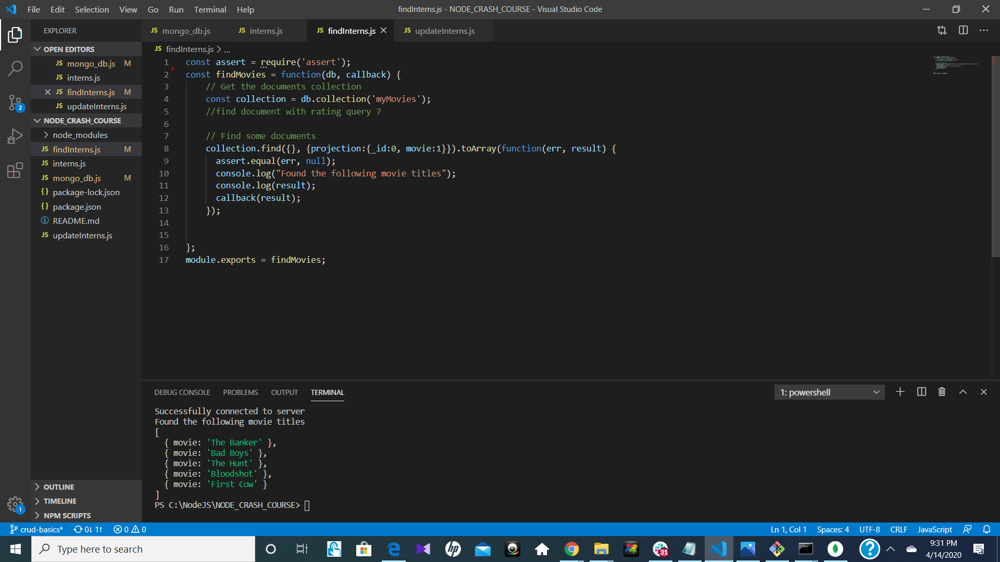

# crud-basics

1. screenshot of documents inserted with create

2. screenshot of first document in collection

3. screenshot of movies with a rating of 7

4. screenshot of showing movie titles only

5. screenshot of updated collection

